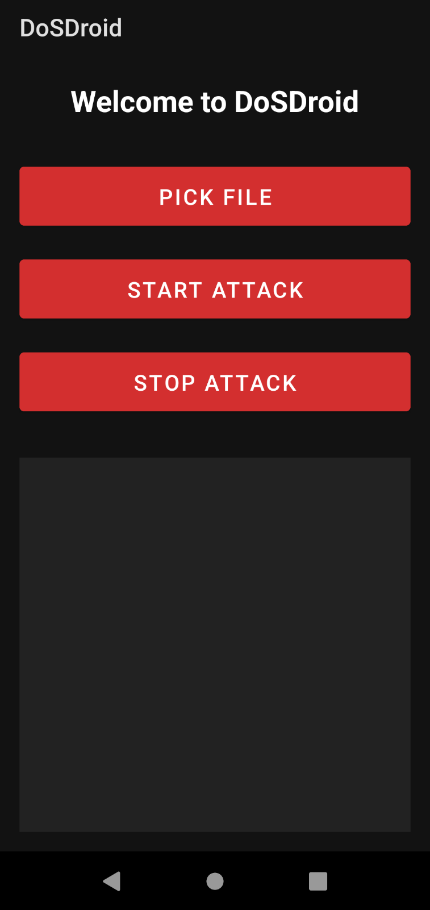

# DoSDroid
## An HTTP Flood Denial-of-Service Tool for Android
<!-- DESCRIPTION -->
## Description:

HTTP flood is a type of Denial of Service (DoS) attack that targets web servers by overwhelming them with a high volume of HTTP requests. Unlike other forms of DoS attacks that may exploit vulnerabilities in the server's software or network infrastructure, HTTP floods rely on legitimate requests to consume server resources, such as CPU and memory. This results in legitimate users experiencing slow response times or being completely unable to access the targeted website.

## Warning: 
This tool is made for educational purposes only. The developer is not responsible for any misuse or unintended consequences arising from the use of this tool.

<!-- FEATURES -->
## Features:

- Supports multiple targets

- Runs in the background

- Real-time logs

- Built in Java

<!-- INSTALLATION -->
## Installation:

[Download](https://github.com/umutcamliyurt/DoSDroid/releases)

## Example Targets File:

```
http://example.com
https://example.com
http://example.com:8080
https://example.com:8443
```

<!-- SCREENSHOT -->
## Screenshot:



<!-- LICENSE -->
## License

Distributed under the MIT License. See `LICENSE` for more information.
